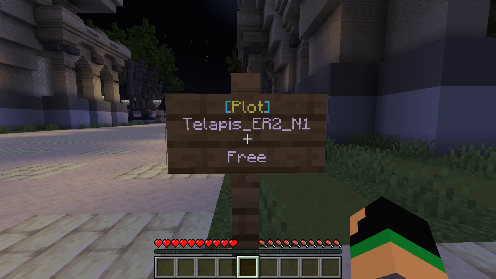
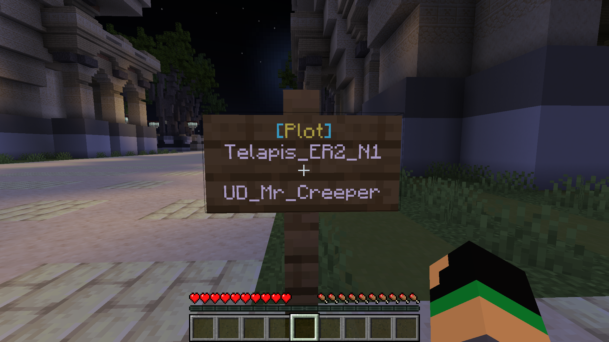

# 关于地皮

对应元素的弹幕兽均可以在对于元素的主城中获取一块地皮。

## 地皮的命名

每一块地皮均有唯一的命名，如　`Telapis_ER2_N1`

- `Telapis` 表示在金之城
- `ER2` 表示金之城东门 II 环
- `N1` 表示北区 1 号

同理，金之城东门 I 环北区 3 号为 `Telapis_ER1_N3`

## 地皮的获取

每一块地皮周围有一块告示牌，如下为金之城东门 II 环北区 1 号：

邮件告示牌即可获取这一块地皮：

## 地皮的管理

- `/plot addmember <ID>` 允许某个玩家在你的地皮上进行建造和破坏
- `/plot removemember <ID>` 移除某个玩家在你的地皮上可以进行建造和破坏的权限