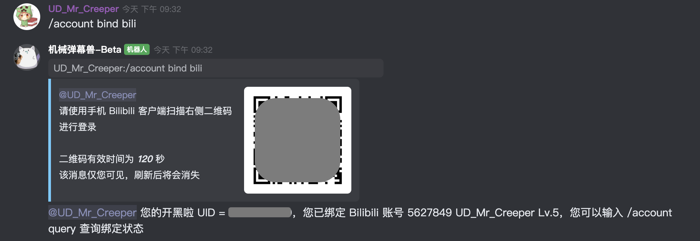
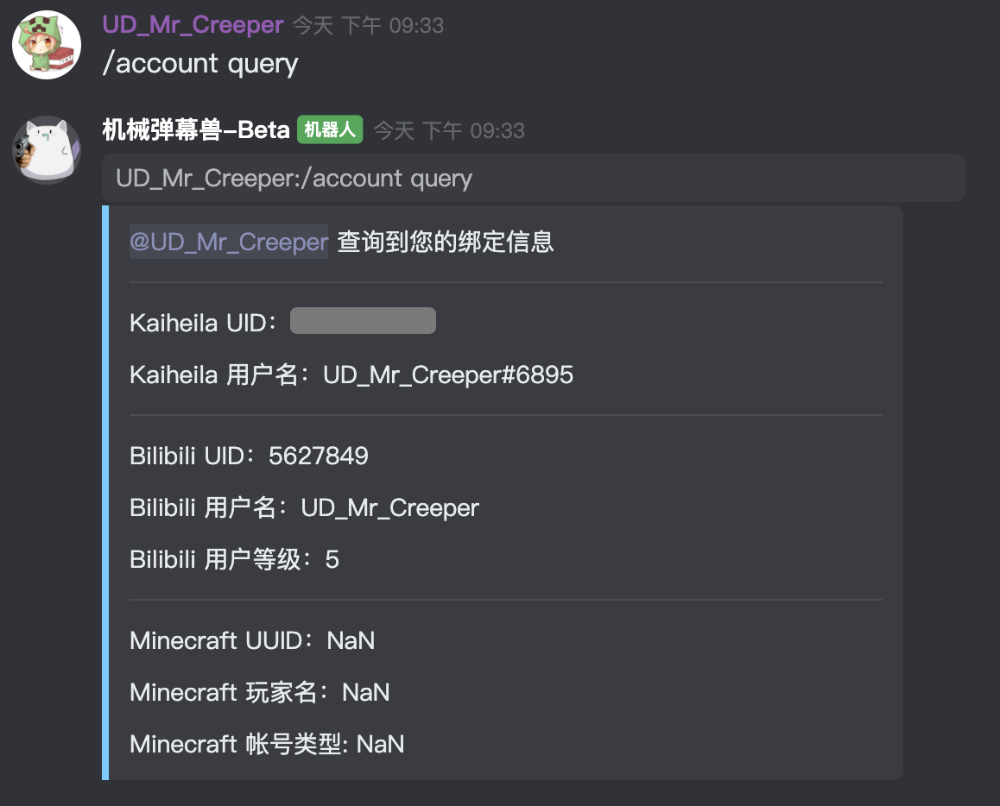
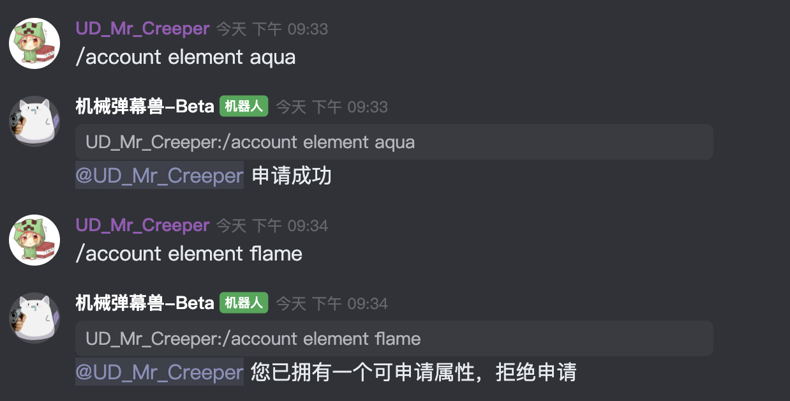

# 从开黑啦开始连接

请确认您将要从开黑啦进行连接，请注意，Discord 和开黑啦只能二者选其一。

我们建议中国玩家选择从开黑啦进行连接。

- 在 Discord 中拥有 `Twitch Subscriber` 或 `Pogtreon` 角色的用户将在服务器中获取 `Energy` 玩家权限组
- 在 开黑啦 中拥有 `金弹幕兽（舰长）` 或 `提督弹幕兽` 或 `总督弹幕兽` 角色的用户将在服务器中获取 `Energy` 玩家权限组

:::caution
开黑啦机器人并不稳定，有可能出现机器人返回消息重复的问题。如果同时收到两条返回消息，请以后一条为准。
:::

:::caution
开黑啦机器人并不稳定，在执行以下操作时，请确保用户 `机械弹幕兽` 在线。
:::

## 第一步 - 绑定 Bilibili

我们需要您绑定 Bilibili 帐号，用来确认身份和确认 Bilibili 直播大航海相关的信息。

请前往 `#帐号绑定频道` 发送指令 `/account bind bili`，你将获得一个二维码，该二维码 2 分钟内有效。请使用 Bilibili 手机客户端扫描二维码进行登录。进行该操作之后，机器人将使用您的登录 Cookie 获取您的 UID，之后将会删除该 Cookie，请不用担心您的帐号安全。机器人程序在中国上海地区的腾讯云服务器上运行。机器人代码开源，您可以查看该功能实现的源代码。

登录成功后，您在 Bilibili 上将会受到 Bilibili 官方帐号 "哔哩哔哩智能姬" 的登录操作通知。"设备/平台" 为 "未知设备"，"登录方式" 为 "扫码登录"，"参考登录地" 为 "中国上海"。点击 "查看详情"，可以获得参考登录地点的 IP 为 "81.69.\*\*\*.\*\*\*" 中国上海。

:::caution
开黑啦机器人并不稳定，执行本操作时，有可能 30 秒仍未返回二维码，若出现此种情况，请等待 10 分钟（慢速模式限制）后重试，若第二次尝试仍然失败，请联系管理员。
:::

绑定成功后，你将获得 "BILIBILI已绑定" 角色标签。如果你是 Bilibili 直播大航海用户，将获得对应的角色标签。请注意，大航海角色标签的获取可能会有至多 2 小时的延迟。

您可以输入 `/account query` 查询您的信息。

## 第二步 - 获取弹幕兽身份

请前往 `#弹幕兽身份申请` 发送指令 `/account element <Element>` 来获取弹幕兽身份属性，请注意，这个属性在未来将不能更改。

:::note
请注意，即使拥有 `Energy` 角色，也必须同时拥有一个普通的四种角色之一。
:::

`<Element>` 可以是以下值：

- `Wind` : 草弹幕兽
- `Aqua` : 海弹幕兽
- `Fire` : 火弹幕兽
- `Earth` : 土弹幕兽

获取成功后，你将获得对应的角色标签。

