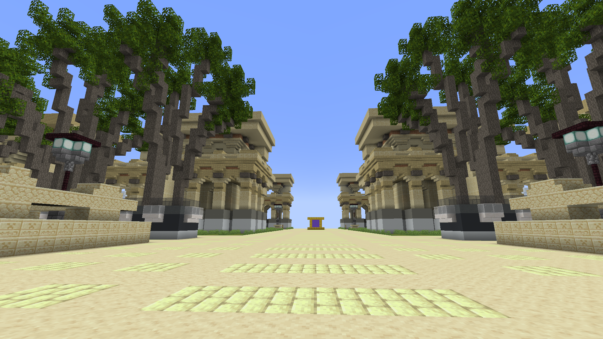

# 服务器：尼比鲁 (Nibiru)

`尼比鲁` 服务器一共有 1 个世界

### 服务器设置

- 服务器出生点位于 `金之城·特拉匹斯 (Telapis)` 的传送大厅，使用 `/spawn` 指令将回到此处
- 服务器不会自然生成任何生物
- 服务器难度为困难
- 服务器禁止了任何类型的爆炸
- 视距为 8 个区块
- 允许使用附魔台

## 金之城·特拉匹斯 (Telapis)

### 简介

金之城·特拉匹斯 (Telapis) 是金属性 (Energy) 弹幕兽的主城。

### 世界设置

- 死亡不掉落

### 目前状况

- 三座金字塔中，两侧的小金字塔暂未开放
- 商店暂未开放 (商店将会提供获取动物的渠道)
- 位于金之城 II 环的金弹幕兽限定的居民区地皮共 20 块 (47*55)
- 位于金之城 I 环的 VIP 权限组限定的居民区地皮共 8 块 (63*76)

### 传送大厅

传送大厅中 **使用砂岩砌成的大型传送门** 通往召唤广场，**使用圆石砌成的大型传送门** 通往尼比鲁自然开发区，**使用砂岩砌成的小传送门** 为城内传送门，通往何处请看门前告示牌。

### 附魔图书室

您可以使用此处的附魔台。

### 东城门

东城门向外的道路通往居民区。

在东城门向外的主干道上，你的速度将会变为原本的 3 倍。

### 居民区

拥有 `Energy` 权限组的玩家可以申领 II 环的一块地皮。

## 花之乡·阿尔卡泰尔 (Arkatelle)

TODO: 计划中，未发布

## 海之都·米纳特米 (Minatemi)

TODO: 计划中，未发布

## 火之域·故土 (Gutu)

TODO: 计划中，未发布

## 土之国·都尔阿萨斯 (Duer Asuz)

TODO: 计划中，未发布