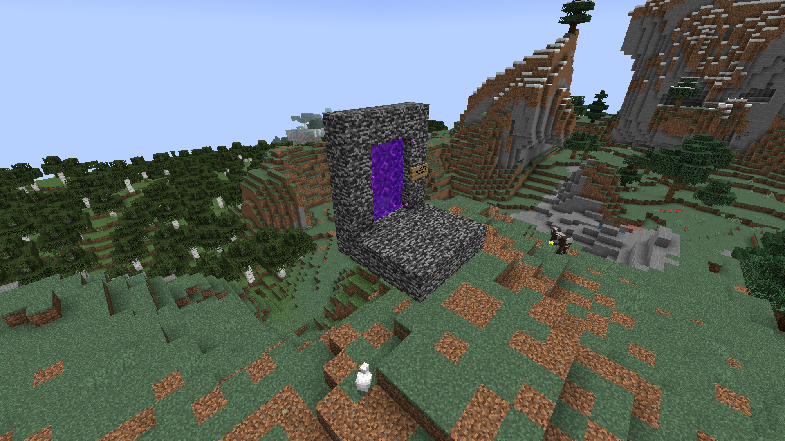

# 服务器：尼比鲁自然开发区 (NibiruNDA)

`尼比鲁自然开发区` 服务器一共有 6 个世界，为 2 个标准的 Minecraft 世界群。

### 服务器设置

- 服务器出生点位于 `尼比鲁的野外 (Wasteland)` 的信标处，使用 `/spawn` 指令将回到此处
- 是标准的 Minecraft 原版生成器生成的世界
- 难度为困难
- 死亡会掉落物品和经验值

## 尼比鲁世界群 (Wasteland，Wasteland_nether，Wasteland_the_end)

### 简介

不会刷新的标准 Minecraft 世界群。

### 世界设置

- 主世界的世界边界为 ±40000 方块
- 下界的世界边界为 ±8000 方块
- 末地暂无限制

### 主世界出生点

本出生点为整个服务器的出生点，包含通往不稳定的异次元世界群主世界和五大主城的传送门，内部区域开启玩家保护，不会受到怪物伤害。信标 Buff 为抗性提升和生命恢复。

## 不稳定的异次元世界群 (UnstableID，UnstableID_nether，UnstableID_the_end)

### 简介

会刷新的标准 Minecraft 世界群。

### 世界设置

- 所有世界均无世界边界限制
- 会删档重置

### 主世界出生点

本出生点无任何保护，仅包含一个通往尼比鲁世界群主世界出生点的传送门。