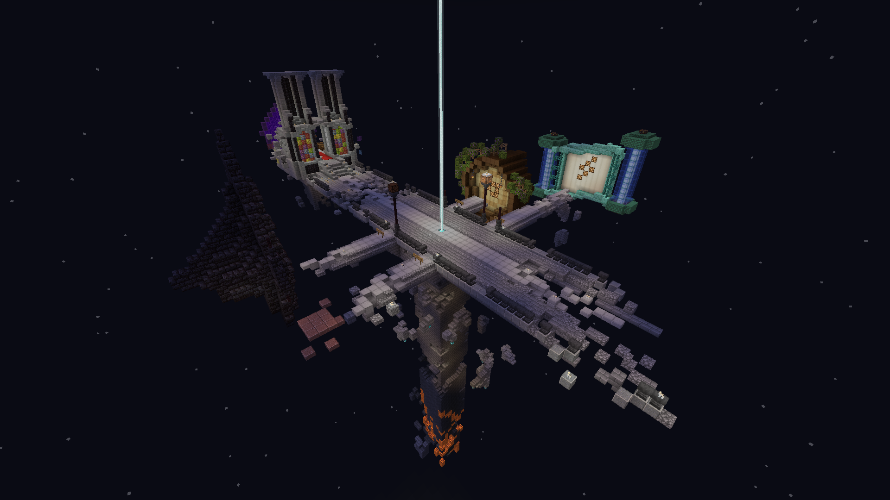

# 服务器：登陆点（SummonS）

`登陆点` 服务器一共有 1 个世界

### 服务器设置

- 服务器出生点位于 `召唤广场 (Summon Square)` 的信标处，使用 `/spawn` 指令将回到此处
- 服务器不会生成任何生物
- 服务器禁止了任何类型的爆炸

## 召唤广场 (Summon Square)

### 简介

召唤广场是所有玩家的出生点，此处有通往五大主城的传送门。

### 目前状况

- 只开放了 `金之城·特拉匹斯 (Telapis)`
- 通往 `土之国·都尔阿萨斯 (Duer Asuz)` 的传送门尚未完工

### 世界设置

- 难度为和平
- 死亡不掉落
- `Admin` 权限以下无权破坏、放置、交互

