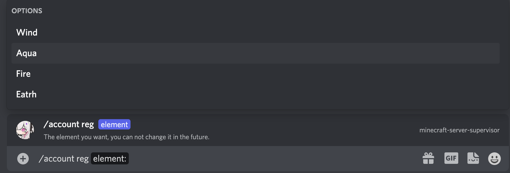
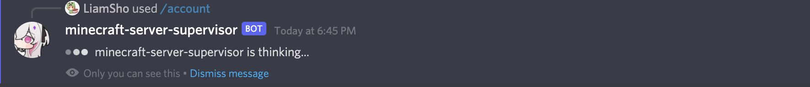
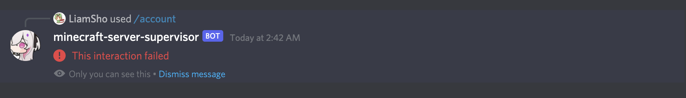
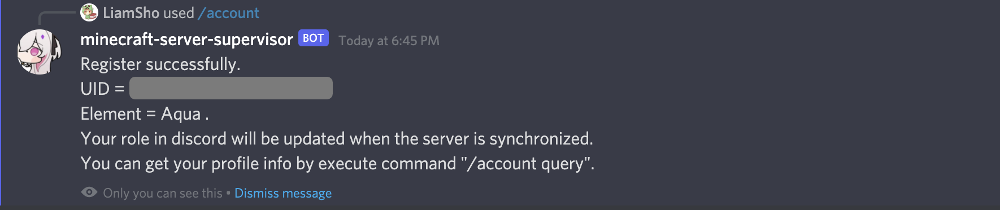
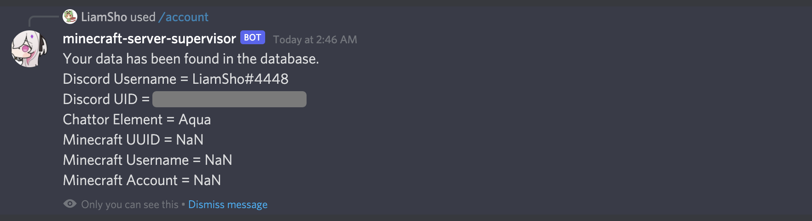

# Connect from Discord

Please make sure you want to connect from Discord. You can choose only one between Kaiheila and Discord.

We recommend that players outside of China choose to connect from Discord.

- Users with the `Twitch Subscriber` role in Discord will get the `Energy` player access group in the server
- Users with the `金弹幕兽（舰长）` or `提督弹幕兽` or `总督弹幕兽` role in Kaiheila will get the `Energy` player access group in the server

## The first step (and also the final step)

Connecting from Discord is a simple, one-step process.

You can go to any channel (`#🤖bot-commands` channel is recommended) and enter the command `/account reg <Element>` to do so. The `Element` parameter has four options, and Discord will automatically complete the command and display the four options available.

`<Element>` can be the following values:
- `Wind` : Wind Element Chattor
- `Aqua` : Aqua Element Chattor
- `Fire` : Fire Element Chattor
- `Earth` : Earth Element Chattor

Each element corresponds to one of the main cities in the server.

The fifth element, `Energy` is exclusive to `Twitch Subscriber` and Bilibili Live Guards.

:::caution
Please note that if Discord does not auto-complete commands, then you do not have permission to use Slash Command on this channel, so it is recommended to go to the `#🤖bot-commands` channel to use the commands.
:::

After the command is issued, the server will receive the request and start processing it.

If an error similar to the figure below causes the command execution to fail, please wait about 1 minute and try again. This problem is mostly caused by the connection error between Discord server and Microsoft Azure data center. Although the command failed to return datas, it is very likely that the command has entered the queue. If you encounter an error when executing the registration command, please wait for 1 minute and try to execute `/account query` command, maybe the registration has already been completed.

Wait a moment for the command process to complete, and the successful response will be as follows, with your UID and the selected Chattor Element string.

:::info
For some unknown reasons, sometimes the command completion message is slow to return, please wait for a while and do not refresh the page or leave the channel, usually no more than 2 minute.

Based on the logs in the backend, we initially believe that this is caused by Discord's slow processing of HTTP PATCH requests.
:::

You can use the `/account query` command to get account information, which contains information about your Discord username, Discord UID, Chattor Element, Minecraft UUID, Minecraft player name, and Minecraft account type (premium/cracked).

