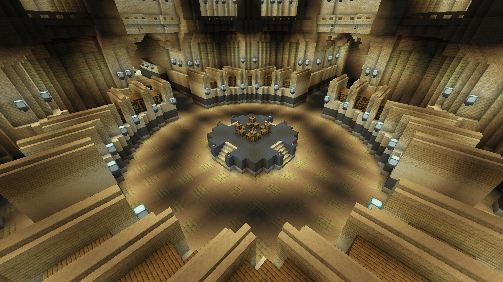
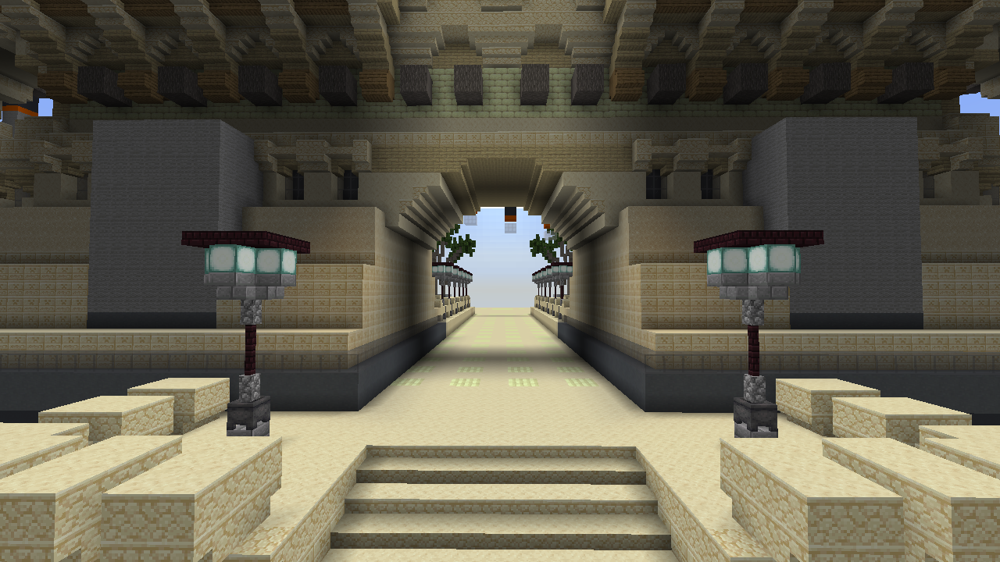
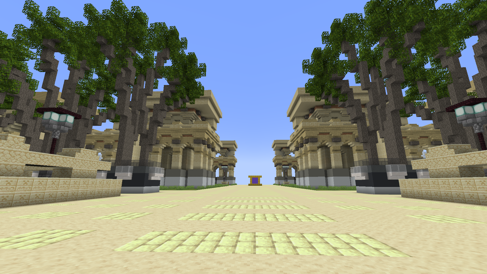

# Server: Nibiru (Nibiru)

`Nibiru` server have 1 world.

### Server settings

- Server spawn point is in `金之城·特拉匹斯 (Telapis)`, use `/spawn` command will teleport you to there
- No mobs
- Hard difficulty
- No explosion
- View distance 8 chunks
- Allowed to use enchanting table

## 金之城·特拉匹斯 (Telapis)

### Intro

金之城·特拉匹斯 (Telapis) is the main city for Energy element Chattor.

### World Settings

- Keep Inventory

### Current status

- Of the three pyramids, the small pyramids on both sides are not yet open
- Store is not currently open (store will provide access to animals)
- A total of 20 plots in the Telapis Ring II for Energy element Chattor. (47*55)
- A total of 8 plots in the Telapis Ring I for VIPs. (63*76)

### Portal hall

In the portal hall, ***large portals made of sandstone*** lead to Summon Square, ***large portals made of cobblestones*** to the Nibiru Natural Development Area, ***small portals made of sandstone*** For the city portal, where to go please see the front sign.

### Enchanting library

You can use the enchanting table here.

### East city gate

The road outward of the East Gate leads to residential areas.

On the main road out of the East Gate, you'll be three times faster.

### Residential areas

Players with `Energy` permission group could get a plot in Ring II.

## 花之乡·阿尔卡泰尔 (Arkatelle)

TODO: Planned, unreleased

## 海之都·米纳特米 (Minatemi)

TODO: Planned, unreleased

## 火之域·故土 (Gutu)

TODO: Planned, unreleased

## 土之国·都尔阿萨斯 (Duer Asuz)

TODO: Planned, unreleased