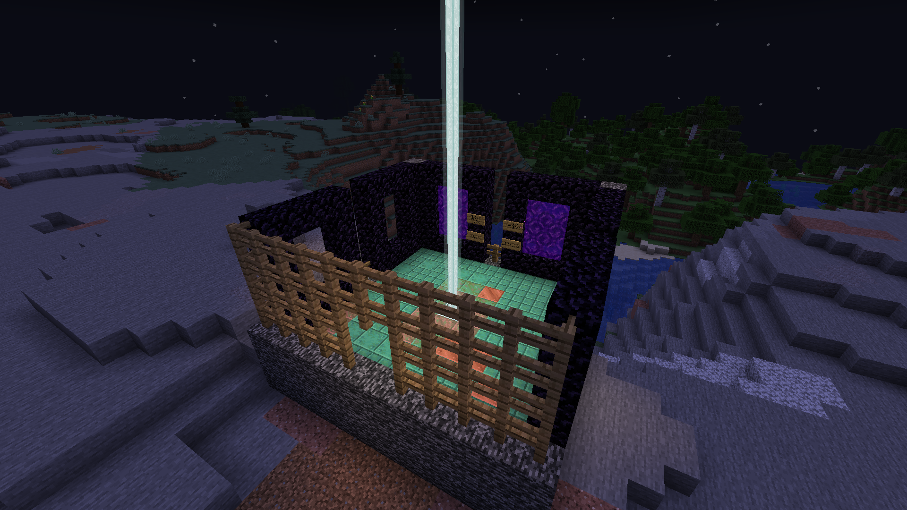
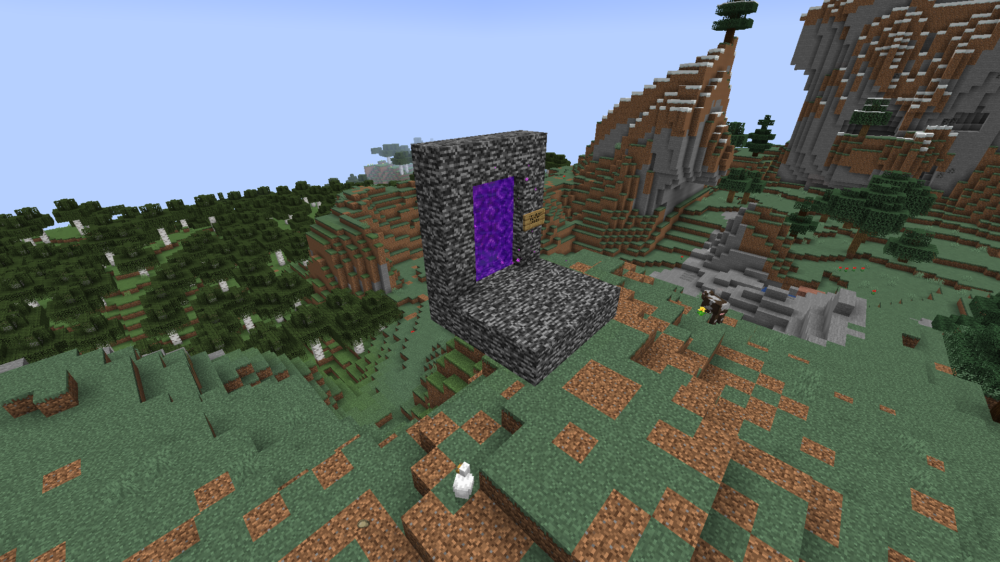

# Server: Nibiru Natural Development Area (NibiruNDA)

`Nibiru Natural Development Area` server have 6 worlds, 2 standard Minecraft world group.

### Server settings

- Server spawn point is in `Wasteland`, use `/spawn` command will teleport you to there
- Standard Minecraft world generator
- Hard difficulty
- NO Keep Inventory

## Nibiru World Group (Wasteland，Wasteland_nether，Wasteland_the_end)

### Intro

Standard Minecraft world group. Permanent.

### World settings

- Overworld worldborder ±40000 blocks
- Nether worldborder ±8000 blocks
- No limit in the End now

### Overworld spawn point

This spawn point is the spawn point of the entire server, containing portals to the unstable interdimensional world and the five main cities, with the internal area open to player protection from monsters. Beacon Buff is Resistance and Regeneration.

## Unstable Interdimensional World Group (UnstableID，UnstableID_nether，UnstableID_the_end)

### Intro

Standard Minecraft world group. ***Nonpermanent***.

### World settings

- No worldborder limit
- Nonpermanent, will be deleted and regenerate

### verworld spawn point

This spawn point has no protection and contains only a portal to the main spawn point in the Nibiru World Group.